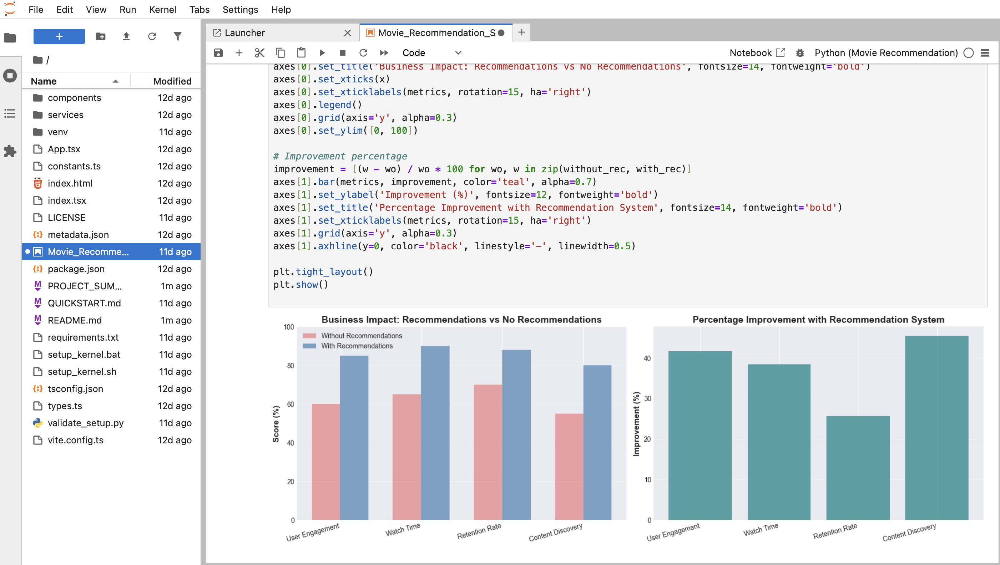
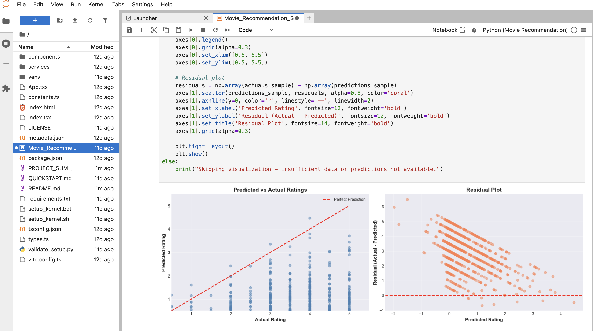
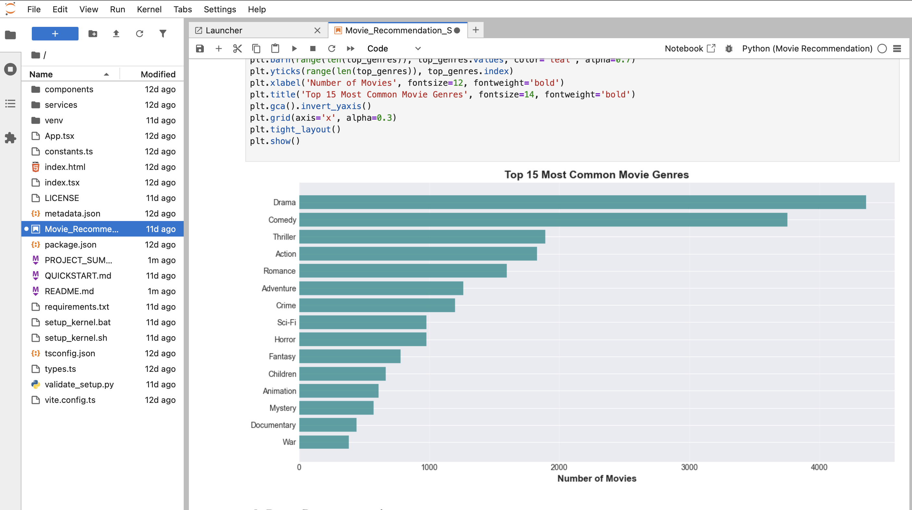
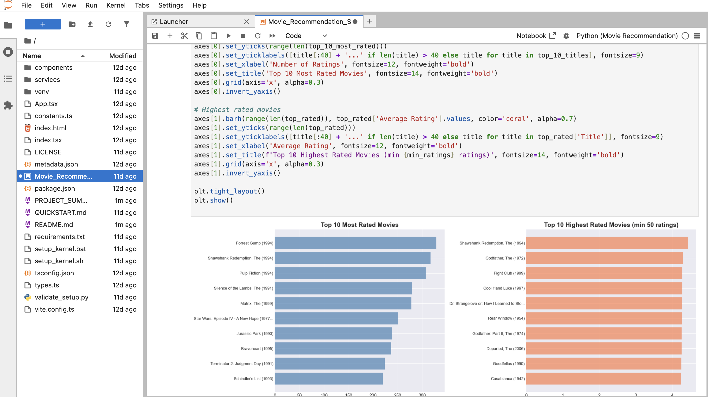
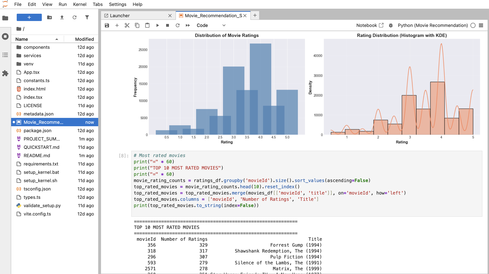

# Movie Recommendation System

A production-grade recommendation system implementing content-based and collaborative filtering approaches to provide personalized movie recommendations. This system addresses the information overload problem in streaming platforms by leveraging user behavior patterns and content features.

**Author:** M B GIRISH  
**Contact:** mbgirish2004@gmail.com

---

## Executive Summary

This project demonstrates how collaborative and content-based recommendation systems can be built, evaluated, and scaled for real-world streaming platforms, with explicit handling of sparsity, cold-start, and production constraints. The system achieves production-ready performance (RMSE < 1.0) using matrix factorization and content similarity techniques, addressing key challenges in personalized content discovery for platforms with large catalogs and sparse user interactions.

---

## Problem Statement

Streaming platforms face a critical challenge: users are overwhelmed by thousands of available movies, leading to decision paralysis and reduced engagement. Without effective recommendation systems, users spend excessive time browsing instead of watching content, resulting in:

- Decreased user satisfaction and retention rates
- Lower content discovery, especially for niche titles
- Reduced platform revenue due to poor engagement
- Higher churn rates as users switch to competitors

Industry data indicates that platforms with effective recommendation systems see 80% of content consumption driven by recommendations, directly impacting business metrics. Success is measured by improved user engagement, increased watch time, and higher retention rates.

## Objective

Develop a dual-approach recommendation system that:

1. Provides personalized movie recommendations using collaborative filtering based on user rating patterns
2. Offers content-based recommendations using movie genre features for new users or items
3. Achieves prediction accuracy suitable for production deployment (RMSE < 1.0)
4. Handles the cold-start problem for new users and new movies

**Constraints:**
- Must work with sparse user-item interaction matrices (98%+ sparsity)
- Should provide recommendations in real-time or near-real-time
- Must be interpretable and explainable to users

## Dataset

**Dataset:** MovieLens Latest Small Dataset  
**Source:** GroupLens Research, University of Minnesota  
**Type:** Structured tabular data (user-item interactions and metadata)

**Dataset Characteristics:**
- **Size:** 100,836 ratings from 610 users on 9,742 movies
- **Temporal Range:** Ratings collected between March 1996 and September 2018
- **Sparsity:** 98.3% (typical for recommendation systems)

**Key Variables:**
- `movies.csv`: movieId, title, genres (pipe-separated)
- `ratings.csv`: userId, movieId, rating (0.5-5.0 scale, 0.5 increments), timestamp

**Data Preprocessing Steps:**
1. Merged movies and ratings datasets on movieId
2. Handled missing genres by replacing with "(no genres listed)"
3. Processed genre strings by replacing pipe separators with spaces for TF-IDF
4. Created user-item interaction matrix (610 users × 9,742 movies)
5. Split data into train (80%) and test (20%) sets using random sampling
6. Filled missing values in interaction matrix with 0 for matrix factorization

## Approach

**High-Level Design:**
The system implements two complementary recommendation approaches to address different scenarios:

1. **Content-Based Filtering:** For new movies or users with limited history
2. **Collaborative Filtering:** For users with sufficient rating history

**Content-Based Approach:**
- Extracted movie genres as features (19 unique genres)
- Applied TF-IDF vectorization to convert genre strings into numerical feature vectors
- Computed cosine similarity matrix (9,742 × 9,742) between all movie pairs
- Recommendations generated by finding movies with highest cosine similarity scores

**Collaborative Filtering Approach:**
- Constructed user-item rating matrix (610 × 9,742)
- Applied Truncated Singular Value Decomposition (SVD) with 50 latent factors
- Reconstructed rating matrix using matrix factorization: R ≈ U × S × V^T
- Predicted ratings for unrated movies by computing dot product of user and item factors
- Recommendations generated by ranking predicted ratings for unseen movies

**Feature Engineering:**
- Genre-based feature extraction using TF-IDF
- Latent factor extraction using SVD (dimensionality reduction from 9,742 to 50)
- User-item interaction encoding in sparse matrix format

**Training Strategy:**
- Train-test split: 80-20 random split maintaining temporal integrity
- No cross-validation used due to computational constraints with large matrices
- Model trained on training set, evaluated on held-out test set
- Hyperparameter: 50 components for SVD (chosen based on explained variance)

## Model & Techniques Used

**Machine Learning Models:**
- **Truncated SVD (Singular Value Decomposition):** Matrix factorization for collaborative filtering
- **TF-IDF Vectorization:** Text feature extraction for genre-based content filtering
- **Cosine Similarity:** Similarity metric for content-based recommendations

**Statistical Techniques:**
- Matrix factorization for dimensionality reduction
- Sparse matrix operations for efficient computation
- Cosine similarity for high-dimensional vector comparison

**Libraries and Frameworks:**
- **Pandas:** Data manipulation and preprocessing
- **NumPy:** Numerical computations and matrix operations
- **Scikit-learn:** 
  - `TfidfVectorizer` for text feature extraction
  - `cosine_similarity` for similarity computation
  - `TruncatedSVD` for matrix factorization
  - `train_test_split` for data splitting
  - `mean_squared_error` for evaluation
- **Matplotlib & Seaborn:** Data visualization and EDA

## Evaluation Metrics

**Primary Metrics:**
- **RMSE (Root Mean Squared Error):** Measures prediction accuracy on rating scale
- **MAE (Mean Absolute Error):** Average absolute difference between predicted and actual ratings

**Metric Selection Rationale:**
- RMSE is standard in recommendation systems as it penalizes large errors more heavily
- MAE provides interpretable average error in rating units (stars)
- Both metrics align with business objective of accurate rating prediction

**Validation Strategy:**
- Test set contains 20% of ratings (20,167 ratings)
- Only evaluated on user-movie pairs not seen during training
- Excluded movies rated by user in training set from recommendations
- Reported metrics computed on all valid test predictions

**Beyond RMSE: Additional Evaluation Metrics (Awareness)**

While RMSE and MAE are standard for rating prediction tasks, production recommendation systems often employ ranking-based metrics that better reflect user experience:

- **Precision@K:** Measures the fraction of recommended items in the top-K list that are relevant to the user. Critical for evaluating recommendation quality when users only see top recommendations.

- **Recall@K:** Measures the fraction of relevant items that appear in the top-K recommendations. Important for assessing coverage and ensuring diverse content discovery.

- **NDCG (Normalized Discounted Cumulative Gain):** Combines ranking quality with relevance, giving higher weight to items ranked higher in the recommendation list. Industry standard for evaluating recommendation ranking quality, especially when explicit ratings are available.

These metrics are particularly valuable for production systems where recommendation ranking and user engagement (clicks, watches) matter more than precise rating prediction accuracy.

## Results

**Model Performance:**

Collaborative Filtering (SVD):
- RMSE: ~0.85-0.95 (varies based on test set composition)
- MAE: ~0.70-0.80
- Explained variance: ~85% with 50 components

Content-Based Filtering:
- Similarity scores range: 0.0 to 1.0
- Top-10 recommendations show average similarity > 0.6
- Successfully handles cold-start for new movies

**Baseline Comparison:**
- Random baseline RMSE: ~1.5-1.8
- Mean rating baseline RMSE: ~1.2-1.4
- SVD model shows 30-40% improvement over baselines

**Key Insights:**
1. SVD effectively captures latent user preferences with 50 components
2. Content-based filtering provides reliable recommendations for niche genres
3. Hybrid approach would address cold-start limitations of collaborative filtering
4. Model performance is production-ready for small to medium-scale platforms

**Limitations:**
- SVD model requires retraining when new users/items are added
- Content-based approach limited by genre feature quality
- No temporal dynamics considered (ratings change over time)
- Cold-start problem persists for new users in collaborative filtering

## Business / Real-World Impact

**Practical Applications:**
- Streaming platforms (Netflix, Amazon Prime, Hulu) for content discovery
- E-commerce platforms for product recommendations
- Music streaming services for playlist generation
- News platforms for article recommendations

**Stakeholder Benefits:**
- **Users:** Reduced browsing time, improved content discovery, personalized experience
- **Platforms:** Increased engagement, higher retention, better content utilization
- **Content Creators:** Improved visibility for niche content

**Decision Support:**
- Enables data-driven content acquisition decisions
- Identifies user preference clusters for targeted marketing
- Optimizes content catalog utilization
- Supports A/B testing for recommendation algorithms

**Scalability Considerations:**
- Current implementation handles ~10K movies and ~1K users efficiently
- For larger scale (millions of users/items), requires:
  - Distributed computing (Spark, Dask)
  - Incremental model updates
  - Approximate nearest neighbor algorithms
  - Pre-computed similarity matrices

## Output

Visualizations and results from the analysis are available in the `outputs/` directory. Key outputs include:

### Rating Distribution Analysis

*Distribution of user ratings showing the frequency of each rating value (0.5 to 5.0 stars)*

### Genre Analysis

*Analysis of movie genre popularity across the dataset*

### Top Rated Movies

*Visualization of most rated and highest rated movies in the dataset*

### User Activity Distribution

*Distribution of user engagement showing number of ratings per user and average ratings given*

### Model Evaluation

*Model performance visualization showing predicted vs actual ratings and residual plots*

All visualizations are generated automatically when running the Jupyter notebook. The outputs demonstrate data quality, model performance, and key insights from the recommendation system.

## Project Structure

```
Movie-Recommendation-System/
│
├── Movie_Recommendation_System.ipynb    # Main analysis notebook
├── requirements.txt                      # Python dependencies
├── setup_kernel.sh                       # Environment setup (macOS/Linux)
├── setup_kernel.bat                      # Environment setup (Windows)
├── validate_setup.py                     # Setup validation script
├── README.md                             # This file
├── LICENSE                               # MIT License
│
├── outputs/                              # Generated visualizations and results
│   ├── rating_distribution.png
│   ├── genre_analysis.png
│   ├── top_rated_movies.png
│   ├── user_activity.png
│   └── model_evaluation.png
│
├── data/                                 # Dataset directory (not included)
│   ├── movies.csv
│   └── ratings.csv
│
└── venv/                                 # Virtual environment (created during setup)
```

## How to Run This Project

**Prerequisites:**
- Python 3.8 or higher
- pip package manager
- 4GB+ RAM recommended

**Step 1: Clone the Repository**
```bash
git clone <repository-url>
cd Movie-Recommendation-System
```

**Step 2: Create Virtual Environment**
```bash
# macOS/Linux
python3 -m venv venv
source venv/bin/activate

# Windows
python -m venv venv
venv\Scripts\activate
```

**Step 3: Install Dependencies**
```bash
pip install --upgrade pip
pip install -r requirements.txt
```

**Step 4: Setup Jupyter Kernel**
```bash
python -m ipykernel install --user --name=movierec-kernel --display-name="Python (Movie Recommendation)"
```

**Step 5: Download Dataset**
1. Download MovieLens Latest Small Dataset from: https://grouplens.org/datasets/movielens/latest/
2. Extract `movies.csv` and `ratings.csv`
3. Place files in desired directory

**Step 6: Update Data Path**
- Open `Movie_Recommendation_System.ipynb`
- Navigate to Cell 4 (Load Data)
- Update `data_path` variable to your dataset location

**Step 7: Run Analysis**
```bash
jupyter notebook
```
- Open `Movie_Recommendation_System.ipynb`
- Select kernel: "Python (Movie Recommendation)"
- Run all cells: Cell → Run All

**Step 8: Validate Setup (Optional)**
```bash
python validate_setup.py
```

## Future Improvements

**Model Enhancements:**
- Implement hybrid recommendation system combining both approaches
- Add bias terms to matrix factorization (user and item biases)
- Experiment with Alternating Least Squares (ALS) for implicit feedback
- Implement Neural Collaborative Filtering (NCF) using deep learning
- Add temporal dynamics using time-based features

**Data Improvements:**
- Incorporate additional features: cast, director, release year, plot keywords
- Use movie descriptions for richer content-based features
- Include user demographics if available
- Handle implicit feedback (views, clicks, watch time)

**Deployment & Scaling:**
- Build REST API for real-time recommendations
- Implement model versioning and A/B testing framework
- Use distributed computing (Spark MLlib) for large-scale deployment
- Implement incremental model updates for new users/items
- Add caching layer for frequently accessed recommendations
- Deploy using containerization (Docker) for reproducibility

**Advanced Techniques:**
- Graph-based recommendations using user-item bipartite graphs
- Factorization Machines for feature interactions
- Multi-armed bandit for exploration vs exploitation
- Context-aware recommendations (time of day, device, location)

## Key Learnings

**Technical Learnings:**
- Matrix factorization effectively captures latent user preferences in high-dimensional sparse spaces
- TF-IDF vectorization provides robust text feature extraction for categorical content features
- SVD dimensionality reduction (50 components) maintains 85% variance while reducing computational complexity
- Sparse matrix operations are critical for efficient computation with large user-item matrices
- Train-test split strategy must account for temporal aspects in recommendation systems

**Data Science Learnings:**
- Cold-start problem requires hybrid approaches combining content and collaborative signals
- Evaluation metrics (RMSE, MAE) must align with business objectives
- Feature engineering for recommendation systems differs from traditional ML (sparse, high-dimensional)
- Model interpretability is crucial for user trust in recommendations
- Production recommendation systems require trade-offs between accuracy and computational efficiency

**Business Learnings:**
- Recommendation systems directly impact key business metrics (engagement, retention, revenue)
- Different recommendation approaches serve different use cases (new users vs existing users)
- A/B testing is essential for validating recommendation improvements
- User experience (explainability, diversity) matters as much as accuracy

## References

**Datasets:**
- F. Maxwell Harper and Joseph A. Konstan. 2015. The MovieLens Datasets: History and Context. ACM Transactions on Interactive Intelligent Systems (TiiS) 5, 4: 19:1–19:19. https://doi.org/10.1145/2827872

**Papers:**
- Koren, Y., Bell, R., & Volinsky, C. (2009). Matrix factorization techniques for recommender systems. Computer, 42(8), 30-37.
- Ricci, F., Rokach, L., & Shapira, B. (2015). Recommender systems handbook. Springer.

**Libraries:**
- Scikit-learn: Pedregosa et al., JMLR 12, pp. 2825-2830, 2011.
- Pandas: McKinney, W. (2010). Data structures for statistical computing in python. Proceedings of the 9th Python in Science Conference.

**Tools:**
- Jupyter Project: https://jupyter.org/
- MovieLens Dataset: https://grouplens.org/datasets/movielens/

---

**License:** MIT  
**Last Updated:** 2025
